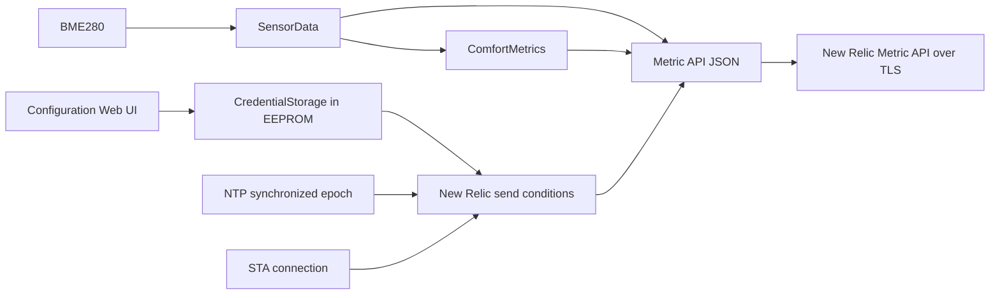

# New Relic Metric API 送信設計

## データフロー

## 保存設計

`CredentialStorage` の既存フィールドの後ろに deviceId、location、Ingest Key の固定長文字列を追加する。旧構造体を `LegacyCredentialStorage` として残し、旧 magic を読み取った場合だけ新構造体へコピーして保存する。これにより、新しい EEPROM サイズで旧領域を直接新構造体として解釈することを避ける。

設定保存時は現在値を基に次の構造体を作成する。SSID、パスワード、湿度補正値、deviceId、location をフォーム値で更新する。Ingest Key はフォーム値が空であれば現在値を維持し、入力された場合だけ更新する。構造体全体が同一の場合は EEPROM へ書き込まない。

## Web UI 設計

既存の `/` と `POST /save` を維持し、同じ設定フォームへ New Relic 項目を追加する。deviceId は HTML の `pattern` とサーバー側検証の両方で半角英数字に制限する。location は空の選択肢と許可された 4 値だけを表示し、POST 値を許可リストで検証する。

Ingest Key は password 入力とし、保存値を HTML に埋め込まない。空欄の意味を「保存済み値を維持」とし、設定済み状態だけを文章で示す。

## 計測設計

`SensorData` に高度を追加し、温度、湿度、気圧と同じセンサー読み取り時に `bme.readAltitude(SEALEVELPRESSURE_HPA)` を取得する。既存 OLED 描画関数は高度を参照しないため、表示レイアウトは変化しない。

## ペイロード設計

ペイロードは 1 個の `common` と 8 個の gauge メトリクスを持つ配列とする。`common.timestamp` は `time(nullptr)` の Unix 秒を使用する。共通属性は保存済み deviceId、location と固定文字列 `BME280` とする。

JSON の文字列値は、deviceId が英数字、location が許可リスト、sensor が固定値であるため追加の自由文字列エスケープを必要としない。固定長バッファへ `snprintf` し、切り詰めが発生した場合は送信しない。

## HTTPS 設計

`NetworkClientSecure` と `HTTPClient` を使用する。信頼するルート CA を `PROGMEM` に保持して `setCACert()` へ渡し、ホスト名と証明書チェーンを検証する。Ingest Key は `Api-Key` ヘッダーだけに設定する。

New Relic 送信は既存エッジサーバー送信と別の最終試行時刻を持つ。設定不足や時刻未同期では通信を開始しない。送信間隔へ到達した後の成否にかかわらず試行時刻を更新し、失敗時に毎秒再試行することを避ける。

## エラー処理

- 設定値が不足または不正な場合は送信しない。
- いずれかのメトリクスが NaN または無限大ならペイロードを生成しない。
- TLS 開始、HTTP POST、HTTP ステータスのいずれかが失敗した場合は false を返す。
- 送信失敗は OLED 更新、設定 Web サーバー、既存エッジ送信を停止させない。
