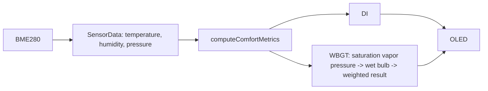

# OLED ヘッダー IP アドレス表示設計

## データフロー

`ComfortMetrics` に WBGT の `float` 値を追加する。計算は既存の指標計算関数と同じ名前空間内に置き、入力として `SensorData` の温度・湿度・気圧を受け取る。

湿球温度は固定回数の二分法とし、探索用の配列・動的確保は使用しない。相対湿度は計算関数内で 0〜100% に制限する。

`drawHeader()` は STA 接続中に `WiFi.localIP()` を y=0 に描画する。STA 未接続時は IP アドレスを描画しない。日付・時刻は既存どおり y=8 に描画し、区切り線は y=15 を維持する。

計測値の描画は `drawSensorLines()` に集約する。左列は x=0 に気温、WBGT、DI を 16 ピクセル間隔で描画し、各値を文字サイズ 2 とする。右列は x=80 に気圧、相対湿度、絶対湿度、VPD を 12 ピクセル間隔で描画し、値と単位を文字サイズ 1 で描画する。左列の項目名は識別のために既存の英字略称を用いる。
