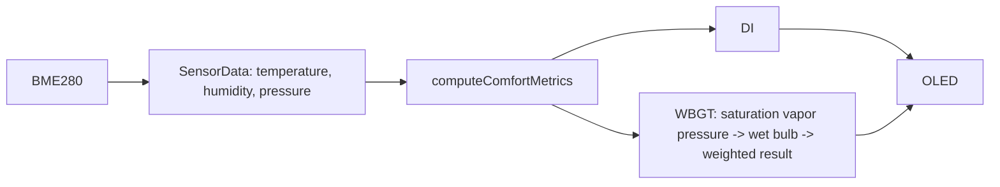

# WBGT 表示追加設計

## データフロー

`ComfortMetrics` に WBGT の `float` 値を追加する。計算は既存の指標計算関数と同じ名前空間内に置き、入力として `SensorData` の温度・湿度・気圧を受け取る。

湿球温度は固定回数の二分法とし、探索用の配列・動的確保は使用しない。相対湿度は計算関数内で 0〜100% に制限する。

描画では既存の `drawMetrics()` を拡張する。WBGT は DI があった左下座標に、ラベルを文字サイズ 1、数値を文字サイズ 2 として 1 行で表示する。DI は `drawSensorLines()` 側で気圧の下に文字サイズ 1 で描画する。これにより左右の既存表示領域を保ったまま要求の配置を実現する。
