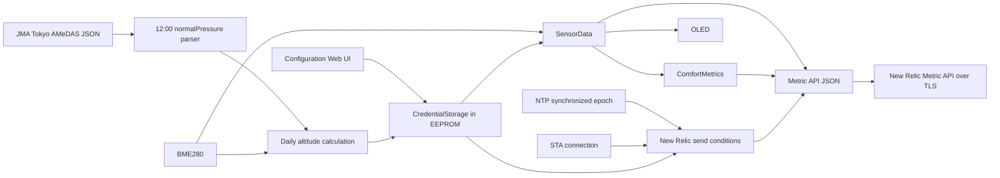

# 気象観測・New Relic 設計

## SoftAP・Web 認証設計

初回起動または旧 EEPROM 形式からの移行時に、ESP32 のハードウェア乱数から12文字のアクセスキーを生成する。小文字と数字から `l`、`o`、`0`、`1` を除いた32文字の固定アルファベットを使用し、乱数の下位5bitをそのまま添字にする。アクセスキーは `CredentialStorage` の末尾へ追加して既存形式からのコピーを単純化する。

SoftAP は既存 SSID `ESP32AP` とアクセスキーを指定して WPA2-PSK で起動する。設定 Web サーバーは従来どおり SoftAP と STA の両方で待ち受ける。各ハンドラーの先頭で共通認証関数を呼び、失敗時は `DIGEST_AUTH`、realm `Climate Monitor` の challenge を返す。独自のログイン画面、セッション、Cookie は追加しない。

設定削除は現在の構造体を基に設定項目を消去し、アクセスキーだけをコピーして EEPROM へ保存する。Wi-Fi パスワード入力と Ingest Key 入力は空欄を「保存済み値を維持」とし、保存値を HTML へ埋め込まない。

起動時刻を保持し、最初の120秒間は通常の気象画面より優先して SoftAP 接続情報を OLED に表示する。センサー初期化に失敗した場合も同じ接続情報を確認できるようにする。

## データフロー

## 保存設計

`CredentialStorage` は海面気圧、対象日、算出標高を保持する。直前の海面気圧対応構造、New Relic 対応構造、旧 Wi-Fi・湿度補正構造の magic を検出し、保持している設定項目を新構造へコピーする。

設定保存時は現在値を基に次の構造体を作成する。SSID、パスワード、湿度補正値、deviceId、location をフォーム値で更新する。Ingest Key はフォーム値が空であれば現在値を維持し、入力された場合だけ更新する。海面気圧と対象日は現在値を維持する。構造体全体が同一の場合は EEPROM へ書き込まない。

気象庁データの取得と標高計算の成功時は現在の構造体を複製して海面気圧、対象日、標高を変更し、EEPROM commit 成功後に RAM 上の値を更新する。失敗時は書き込まない。

## Web UI 設計

既存の `/` と `POST /save` を維持する。deviceId は HTML の `pattern` とサーバー側検証の両方で半角英数字に制限する。location は空の選択肢と許可された4値だけを表示し、POST 値を許可リストで検証する。

Ingest Key は password 入力とし、保存値を HTML に埋め込まない。空欄の意味を「保存済み値を維持」とし、設定済み状態だけを文章で示す。

## 気象庁取得設計

NTP 同期済み、STA 接続中、BME280 利用可能のときだけ取得する。JST 13:00 以降で当日の保存値がなければ取得し、失敗時は1時間間隔で再試行する。

既存の `NetworkClientSecure` と `HTTPClient` を再利用する。気象庁ホストの `GlobalSign Root CA - R3` を `PROGMEM` に保持し、TLS とホスト名を検証する。

レスポンス全体を `String` に格納せず、HTTP ストリームを固定長バッファで走査する。当日12:00のキーを確認し、`normalPressure` の値を `strtof` で数値化して品質コードと範囲を検証する。

取得成功後に BME280 の気温と測定気圧を読み、標高を算出する。海面気圧、対象日、標高を1回の EEPROM commit で保存する。

## 計測・表示設計

`SensorData` の標高には EEPROM の保存値を設定する。固定基準気圧の `bme.readAltitude()` とセンサー更新ごとの再計算は使用せず、OLED と New Relic が同じ日次値を参照する。

`ComfortMetrics.wbgt` は、補正後の気温と 0〜100% に制限した相対湿度から Stull の近似式で湿球温度を求め、`0.7 × 湿球温度 + 0.3 × 気温` で算出する。反復計算と気圧入力は使用しない。OLED と New Relic は同じ `ComfortMetrics.wbgt` を参照する。

OLED は右列を9px間隔の5行にし、気圧の直下へ標高を追加する。左列とヘッダーの位置は変更しない。

## ペイロード設計

ペイロードは1個の `common` と8個の gauge メトリクスを持つ配列とする。`common.timestamp` は `time(nullptr)` の Unix 秒を使用する。共通属性は保存済み deviceId、location と固定文字列 `BME280` とする。

JSON の文字列値は、deviceId が英数字、location が許可リスト、sensor が固定値であるため追加の自由文字列エスケープを必要としない。固定長バッファへ `snprintf` し、切り詰めが発生した場合は送信しない。

## HTTPS 設計

New Relic と気象庁の双方で `NetworkClientSecure` と `HTTPClient` を使用する。各ホストの信頼するルート CA を `PROGMEM` に保持して `setCACert()` へ渡し、ホスト名と証明書チェーンを検証する。Ingest Key は New Relic の `Api-Key` ヘッダーだけに設定する。

New Relic 送信は既存エッジサーバー送信と別の最終試行時刻を持つ。設定不足や時刻未同期では通信を開始しない。送信間隔へ到達した後の成否にかかわらず試行時刻を更新し、失敗時に毎秒再試行することを避ける。

## エラー処理

- 気象庁の HTTP/TLS 失敗、対象日不一致、東京行不在、不正値では保存値を変更しない。
- 保存済み標高がない場合は標高を `NAN`、OLED を `--m` とし、New Relic 送信を見送る。
- New Relic の設定値が不足または不正な場合は送信しない。
- いずれかのメトリクスが NaN または無限大ならペイロードを生成しない。
- 通信失敗は OLED 更新、設定 Web サーバー、既存エッジ送信を停止させない。

## 自己検証

`tests/test_altitude_and_jma.py` は、12:00の `normalPressure`、品質値、範囲、代表入力に対する標高計算結果を標準ライブラリの `assert` で確認する。`tests/test_wbgt.py` は代表入力に対する Stull の湿球温度と WBGT を確認する。
